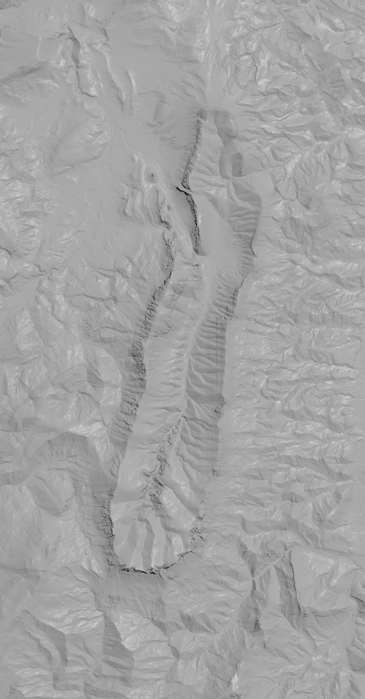

# 3D model of the Synclinal (France / Drôme) for 3D printing



## Download height map data

Download data from [ign](https://geoservices.ign.fr/rgealti), put and extract it in `import-height-map`.

## Generate height map

```bash
cd import-height-map
poetry run import_height_map/generate.py
```

## Generate 3D model

Open 3d-synclinal.hipnc with Houdini and generate the 3D model
